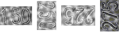

# SimpleClassifier
<!-- @import "[TOC]" {cmd="toc" depthFrom=1 depthTo=6 orderedList=false} -->

<!-- code_chunk_output -->

- [SimpleClassifier](#simpleclassifier)
  - [1. pipeline](#1-pipeline)
    - [1.1 data](#11-data)
    - [1.2 model](#12-model)
    - [1.3 forward(similar with model)](#13-forwardsimilar-with-model)
    - [1.4 loss](#14-loss)
    - [1.5 backward](#15-backward)
    - [1.6 weight/bias update](#16-weightbias-update)
    - [1.7 metric](#17-metric)
    - [1.8 export](#18-export)
  - [2.0 dataset](#20-dataset)

<!-- /code_chunk_output -->

## 1. pipeline

### 1.1 data
* dataset
    * transform
* dataloader

### 1.2 model
* backbone

### 1.3 forward(similar with model)

### 1.4 loss
* ce loss

### 1.5 backward
* backward

### 1.6 weight/bias update
* optimizer
* sgd

### 1.7 metric

### 1.8 export

## 2.0 dataset

* [text direction classify dataset](https://pan.quark.cn/s/99b30d0f1244)

